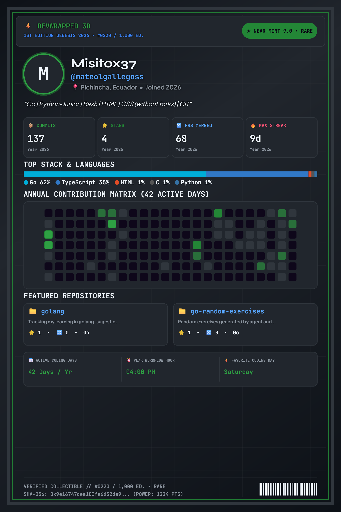

## Hi there, I'm Mateo Gallegos - aka Misito 

  

 

<!-- Website -->

<!-- LinkedIn -->

<!-- YouTube -->

<!-- Instagram -->

<!-- Spotify -->

---

## I'm a Begginer Programmer, with five months of experience. 

- 👨‍💻 I’m currently working on my programming knowledge, learning tools, understanding agents workflow.
- 📚 I’m currently learning about Networking, Golang and AI agents (focussing o harnesses). 
- 💪🏼 Future Goals: Build and deploy systems with clean architecture, with AI-agents purposes.
- ⚡ Fun fact: I love to use Linux, I'm defender of Unix philosophy: "Do one thing, and do it well".

---

### Languages

---

### Frameworks, Libraries and ORM's

---

### Platforms

---

### Tools 🛠 

---

### Operative Systems

---

 

  <h2 align="center"> Github Statistics 📈 </h2>
  
  
 
     

---

Last Edited on: 30/08/2026
